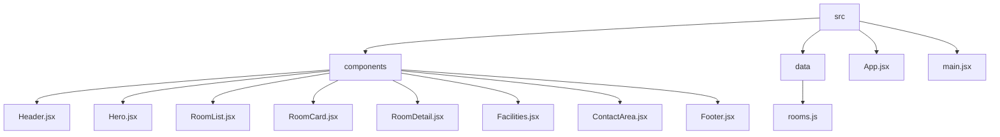

# Ohana - Professional Accommodation Rental Website

A modern website project for searching and renting rooms, apartments, and living spaces, built with **React (Vite)** and **Bootstrap 5**.

## 🌟 Key Features

*   **Landing Page**: Modern design covering introduction, featured listings, amenities, and contact info.
*   **Smart Search**: prominent search bar on the Hero Banner allowing filtering by Location, Room Type, and Price.
*   **Room Listing**: Responsive Grid layout, adapting well to all devices (Mobile/Tablet/Desktop).
*   **Room Detail**: Detailed information page with large images, amenities list, descriptions, and a direct contact form.
*   **Smooth Navigation**: Uses `react-router-dom` and `react-router-hash-link` for seamless page transitions and scrolling to sections without being obscured by the fixed Header.

## 📂 Project Structure



*   `src/components/`: Contains UI components
    *   `Header.jsx`: Fixed Navbar
    *   `Hero.jsx`: Image Carousel & Search Bar
    *   `RoomList.jsx`: List of rooms (Grid Layout)
    *   `RoomCard.jsx`: Card component displaying room info
    *   `RoomDetail.jsx`: Room details page
    *   `Facilities.jsx`: Amenities section (Wifi, Security, etc.)
    *   `ContactArea.jsx`: Contact form & Google Maps
    *   `Footer.jsx`: Page footer
*   `src/data/rooms.js`: Mock Data for rooms
*   `src/App.jsx`: Main Component & Routing

## 🎨 Color Scheme & UI

*   **Primary Color**: `#0D6EFD` (Blue)
*   **Backgrounds**:
    *   White (`#FFFFFF`): Main content.
    *   Light Gray (`#F8F9FA`): Room List Section.
    *   Light Blue (`#E7F1FF`): Facilities Section.
*   **Footer**: `#052C65` (Dark Navy).

## 🚀 Installation & Setup

1.  **Clone the repository:**
    ```bash
    git clone <your-repo-link>
    cd lab3
    ```

2.  **Install dependencies:**
    ```bash
    npm install
    ```

3.  **Run development server:**
    ```bash
    npm run dev
    ```
    Access: `http://localhost:5173`

4.  **Build for Production:**
    ```bash
    npm run build
    ```

## 🛠 Technologies Used

*   [React](https://react.dev/) (Vite)
*   [React Bootstrap](https://react-bootstrap.github.io/) (UI Framework)
*   [React Router DOM](https://reactrouter.com/) (Navigation)
*   [React Icons](https://react-icons.github.io/react-icons/) (Icon Set)

---
Developed by Thien Duong.
